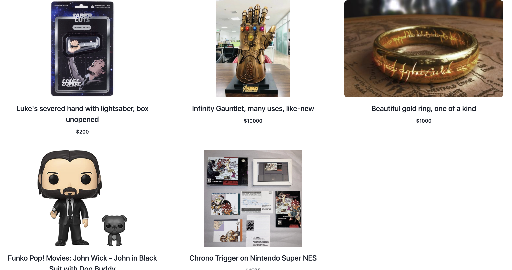

# <ins>Geek Emporium</ins>

## <ins>Description</ins>

Comic Con is a well known convention with tons of venders who sell merch for every type of pop culture you can think of. However tickets sell out quickly, why not avoid the crowds and shop for rare collector's items from the comfort of your couch? 

We created an ecommerce application that allows you create listing for your figurines, cards, games, etc., or you can purchase items that other people are listing for sell.

## <ins>Table of Contents</ins>

- [Installation](#installation)
- [Usage](#usage)
- [License](#license)
- [Features](#features)
- [Contributions](#contributions)
- [Tests](#tests)
- [Questions](#questions)

## <ins>Installation</ins>

npm i, mysql

## <ins>Usage</ins>

Many of our team members enjoy gaming, watching tv, and other pop culture activities. We wanted to create an app that could bring people with these same interests together to shop and sell collector’s items.

### [Check out the Geek Emporium!](https://radiant-plateau-99993.herokuapp.com/)

## <ins>License</ins>

This project is covered under MIT

## <ins>Features</ins>

- Create an account

- Sign in to your account

- Input your item information

- Upload your item image

- Create a listing

- Edit your listing

- View your listings

- View other listings

## <ins>Contributions

- [xBOBOYx](https://github.com/xBOBOYx)
- [xanschwarz](https://github.com/xanschwarz)
- [kirafaye99](https://github.com/kirafaye99)
- [Aniesia-Schmolesky](https://github.com/Aniesia-Schmolesky)
## <ins>Tests</ins>

no testing done

## <ins>Questions</ins>

Contact BOBOY at boboy.zamora@gmail.com. Github link: https://github.com/xBOBOYx
